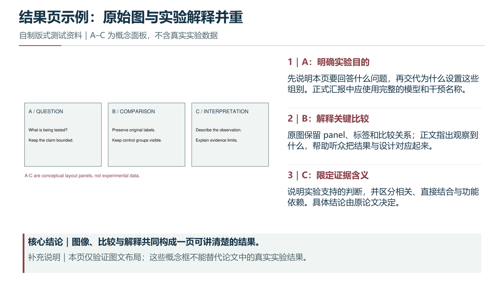
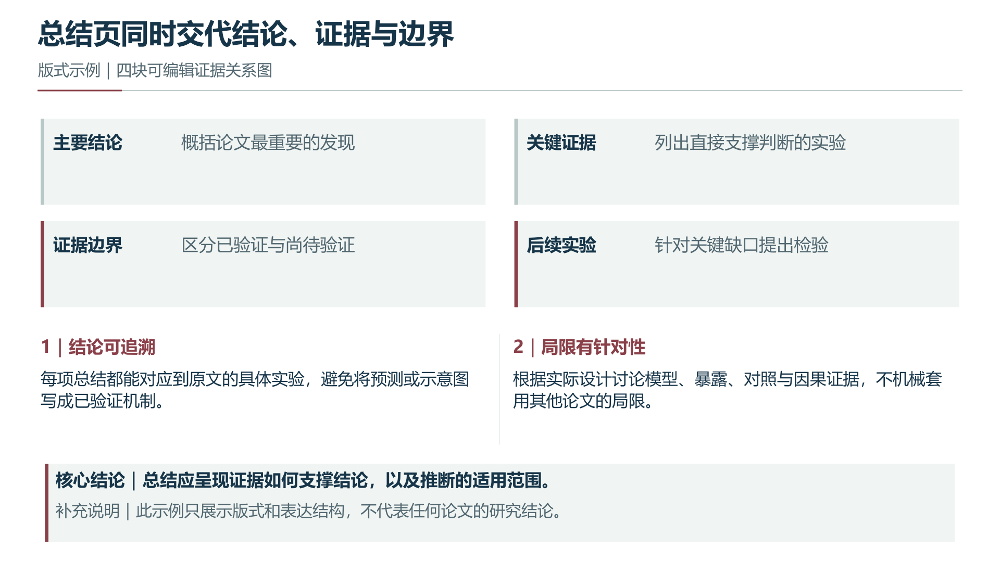

# journal-club-ppt

上传科研论文后，由 Codex 一次完成中文组会 PPTX、PDF 和讲者备注。默认原文首页截图封面；结果页采用“完整结论标题＋条件＋分隔线＋原图与解释＋核心结论与补充说明”。

**不要求安装 `nature-paper2ppt`、`presentation-skill` 或其他 skill。** 论文组织、Figure 裁图、原生排版、主题、增量修改和检查程序都在本仓库内。安装一个 skill 不会同时获得模型的看图能力、图像生成权限或 Office 软件；这些环境条件会在开始前检查。

## 给普通用户的一条启动指令

把论文上传给具备本地文件读写、命令执行和看图能力的 Codex，并发送：

> 请安装并使用 https://github.com/riteouschris-max/journal-club-ppt 的技能。将仓库下载到本地，运行 install.py 完成安装和依赖准备；若已安装则先备份再更新。安装后读取技能 SKILL.md，直接把我上传的论文做成正式组会 PPTX、PDF 和完整讲者备注。首页采用原文 PDF 截图，结果页按图文平衡、大字号解释、核心结论加补充说明制作。完成科学阅读、原图核验和实际渲染检查后交付，中间不需要我逐页确认。

“一次启动”指模型接到这一条请求后完成整个流程；`install.py` 本身只安装技能和依赖，不会自动理解论文。新安装的技能若尚未出现在宿主列表，执行方可直接读已安装的 SKILL.md 继续；宿主也可能需要重新打开会话才能自动发现技能。

已安装的用户只需上传论文并说：

> 使用 $journal-club-ppt，直接制作这篇论文的正式组会 PPTX 和 PDF，按技能定稿标准完成并检查。

## 本地安装

下载并解压整个仓库，保留目录结构。需要 Python 3.10–3.13：

```bash
python install.py
```

Windows 可把 `python` 换为 `py -3.12`，macOS/Linux 通常使用 `python3`。Codex Desktop 可以先用其运行环境工具定位 Python。默认安装到 `$CODEX_HOME/skills/journal-club-ppt`，未设置时为用户目录下 `.codex/skills/journal-club-ppt`。已有版本先备份到 `.codex/skill-backups`；不会删除原项目。

下载目录已经是最终技能目录时，只需要：

```bash
python setup.py
python scripts/run.py doctor
```

安装器只给本技能建立 `.venv`，不借用其他 skill 的环境，也不修改系统 Python。`requirements.txt` 固定主要依赖版本。再次执行会复用环境，不重复下载已有包。首次安装需要能访问 PyPI；Python 版本或平台无可用安装包时会报告失败。

## 必需能力与可选能力

| 能力 | 如何获得 | 缺少时的处理 |
|---|---|---|
| 图文理解模型、文件与命令工具 | 由执行技能的宿主提供 | 不能仅凭脚本替代逐实验阅读和看图检查 |
| PyMuPDF、Pillow、python-pptx、fonttools | `setup.py` 安装到独立 `.venv` | 安装成功后继续；失败保留准确错误 |
| 可用中文字体 | 自动检查已安装的微软雅黑、苹方或 Noto CJK 等 | 安装合法字体后指定实际字体文件 |
| 实际 PPTX→PDF 导出器 | 优先 LibreOffice；Windows 支持已安装 PowerPoint | 保留 PPTX 和待导出检查点，不能声称最终 PDF 完成 |
| 图像生成工具 | 可选，由宿主/账号提供 | 使用内置可编辑流程图和证据关系图，科学结果页仍用原图 |
| 其他 skills | 标准流程不需要 | 无影响，无隐藏的跨 skill 脚本调用 |

指定已有 LibreOffice 和中文字体（实际路径可能不同）：

```bash
python setup.py --soffice /actual/path/to/soffice --font-file /actual/path/to/chinese-font.otf
```

配置写在本机 `.runtime.json`，不提交 GitHub。字体也必须能被导出软件使用；fonttools 检查基本中文字符覆盖不等于实际渲染全部合格。字体切换后要检查所有页面。

如果没有导出软件，可安装 [LibreOffice 官方发行版](https://www.libreoffice.org/download/download-libreoffice/)。安装器不会自动安装大型 Office 应用或代替用户处理许可/管理员权限。Windows 已安装 PowerPoint 时会自动尝试备用适配器；如 PowerPoint 正在打开，适配器停止以免干扰当前工作，可使用 LibreOffice或先自行关闭 PowerPoint。

如果平台已有另一种可靠的 PPTX 导出工具，使用后按 [构建说明](references/build-and-check.md) 的 `record-export` 登记和核验实际 PDF。不能把重新绘制的 PDF 当作 PPTX 导出结果。

## 安装后先看一个完整示例

```bash
python scripts/run.py demo --workspace /absolute/path/to/empty-demo-directory
```

示例自动生成五页：原文截图封面、逻辑背景、左右图文结果页、上下图文结果页、四块证据总结。输入是明确标注的自制排版资料，**没有真实论文、作者或实验数据**。它展示无图像生成工具时的基础视觉，并实际执行 PDF 导出、原图像素核验和机器检查。示例不会覆盖非空目录。





图片是这套模板的真实渲染。高级生成插画取决于宿主是否提供图像工具，不能保证所有账号和设备生成完全相同的插画；原生图文布局和结果页结构可以独立复用。

## 制作、续做与交付

论文阅读、逐页科学解释及 `deck.json` 编写由模型按 SKILL.md 完成。模型随后使用：

```bash
python scripts/run.py project init --workspace WORK --paper PAPER.pdf
python scripts/run.py finish --workspace WORK
python scripts/run.py audit --workspace WORK
```

构建所需图源、Figure 清单和逐页内容的完整格式见 [build-and-check.md](references/build-and-check.md)。`finish` 不会替模型编写缺失的科学内容，源文件尚未准备好时会明确报错。

交付包括 `build/deck.pptx`、`output/deck.pdf`、`build/deck.notes.md` 和 `qa/report.json`。`NEEDS_VISUAL_REVIEW` 表示程序检查后仍需查看真实页面；只有实际看过并解决问题后，才记录 `audit --reviewed-pages all`。局部修改保留稳定页 ID、原图哈希、锁定结论及检查点，不重新读取全部论文。

## 能力来源与验证范围

见 [独立能力清单](references/independence.md) 和 [验证记录](examples/validation.md)。该版本将原先多技能流程中需要的通用方法整理为本仓库自己的规则和程序；没有把其他 skill 的整套文件、虚拟环境或本机论文复制进来。

一致性保证来自固定版式、依赖检测、原图保护和实际检查，不是“一次生成必然完美”的承诺。不同论文仍需要科学判断；模型能力、输入完整性、字体和渲染器会影响结果。
